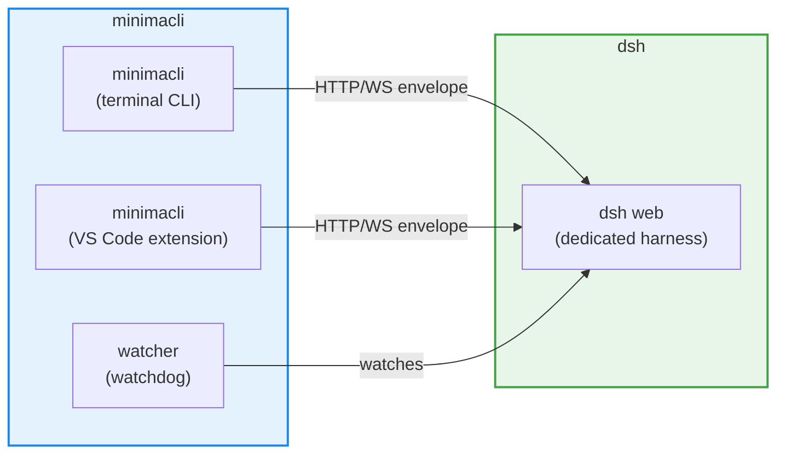
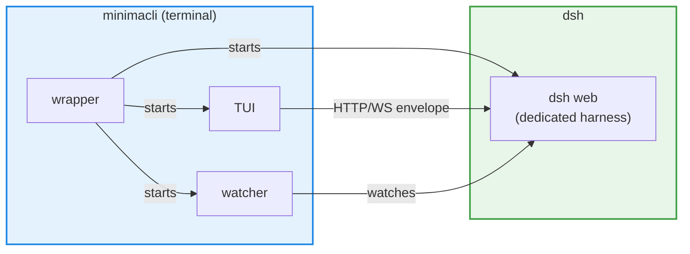
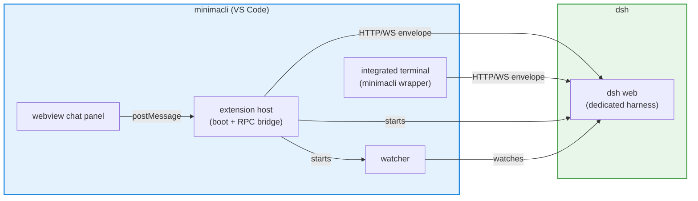

# minimacli — DSH client architecture (CLI TUI + VS Code extension)

> minimacli complements the DSH web GUI with a terminal CLI and a VS Code
> extension — thin clients that talk to an already-running harness over
> HTTP/WebSocket.

## 1. Goal

Complement the web GUI with two additional surfaces — a terminal CLI and a VS
Code extension — driven by six objectives:

1. **Security** — for us, security means the harness alone enforces the sandbox and the approval policy; no client ever holds that power.
2. **Isolation** — for us, isolation means the harness and the client are separate worlds: the client reaches the harness without access to its internals, state or processes.
3. **Decoupling** — for us, decoupling means the client's lifecycle has nothing to do with the harness's plugins, profiles or configuration.
4. **Simplicity** — for us, simplicity means one command does everything: no manual web startup, no extra steps.
5. **Continuity** — for us, continuity means the same conversation is available from any surface, exactly where it left off.
6. **Concurrency** — for us, concurrency means multiple sessions can be created at the same time — more than one conversation running simultaneously without conflicts, even within the same workspace.

### 1.1 Background

We evaluated existing DSH clients and TUIs before building minimacli. None met
our requirements — security under the user's control, isolation between harness
and client, decoupling from the harness's plugin/profile system, a single
command, conversation continuity and concurrent sessions — so we built minimacli
as a thin client family around a dedicated harness instance.

## 2. Approach

A single strategic decision carries all six objectives: the CLI and the VS Code
extension are **clients** — thin front-ends that talk to an already-running
harness over its HTTP/WebSocket API, never booting their own harness profile.
That is what makes each objective reachable:

- the host alone decides what to execute and how → **Security**
- the client only sees the public API → **Isolation**
- any harness speaking the HTTP envelope works — no install, no version coupling → **Decoupling**
- the wrapper starts the dedicated web on demand → **Simplicity**
- all clients share the same session store → **Continuity**
- sessions are created freely, even within the same workspace → **Concurrency**

The plugin path was rejected: plugin TUIs boot their own harness profile and
ship uncontrollable security defaults.

## 3. Model: client



- Two **clients** — a terminal CLI and a VS Code extension — both talk to the
  already-running host at `http://127.0.0.1:<port>`.
- The **dedicated web** is a harness instance (`@deepseek-ai/dsh` + web profile)
  running on its own port.
- The **watcher** is a lightweight process that decides when to kill the web and cancel orphaned turns.
- **Tools live in the DSH, not in the client** — the client only renders, sends
  prompts and answers approvals via `respond`; whoever executes `read`/`write`/`pwsh`
  etc. is the host (`dsh web`). The sandbox (read-only / workspace-write) is enforced
  by the host.

## 4. Components

### 4.1 TUI client — `minimacli`



Lifecycle role: **register** in the ledger (with `sessionId`), **connect** to the
dedicated web and, on clean exit (Ctrl+C), **cancel the turn** as a safety net.
It kills nothing — the watcher does the killing.

### 4.2 VS Code extension — `minimacli`

Two surfaces, sharing the same dedicated web, ledger and watcher as the CLI:



- **Webview chat panel** — native chat UI with history and approvals. It does
  not talk to the web directly: the extension host is the bridge that performs
  the RPC and forwards results to the panel.
- **Integrated terminal** — opens the same `minimacli` wrapper (full
  lifecycle reuse).

### 4.3 Watcher — `watcher`

The watcher is what makes the user lifecycle requirements of §5 hold: without
it, nothing would kill the web when the last client closes, and turns orphaned
by a client that died without notice would run forever. It is a dedicated
process that **owns the kill and turn-cancellation decisions** — no client
kills anything, and no client cancels another client's turn.

1. Exits if the dedicated web is gone.
2. Periodically reads the ledger and **prunes dead clients**.
3. **When pruning a dead client, cancels its in-flight turn** (see §5.3).
4. When the client list is **empty**, cancels the remaining running turns and
   **kills the web**.

The watcher is a cleanup-only mini-client: it talks to the web's API and does
nothing else.

### 4.4 Ledger — `~/.minimacli/clients.json`

JSON file, **not a process**. Shared contract between our clients and the
watcher:

- `port` — the dedicated web's port.
- `hostPid` — the web process PID.
- `watcherPid` — the watcher process PID.
- `managed` — whether this web is ours (managed) or external.
- `clients[]` — each entry: `pid`, `sessionId`, `cwd`, `kind` (`tui` | `vscode`).
  - The client identity is the **PID of the process** using the web (the TUI
    process in the CLI, the extension host in VS Code).
  - `sessionId` is what lets the watcher cancel the right turn of a dead client
    (see §5.3).

## 5. Lifecycle

User lifecycle requirements (explicitly requested; they operationalize the
objectives of §1):

1. **No manual web startup** — the first client to open starts the dedicated web by itself.
2. **No processes left running** without a client — when the last client closes, the dedicated web dies.
3. **Ctrl+C truly aborts** — cancels the in-flight turn via the API *before* finalizing.
4. **Never touch `:3080`** — if there is an unmanaged web on that port (like the one hosting the current session), it is left alone.

### 5.1 Boot — decision flow (same for CLI and extension)

```text
if no ledger:                 start web + watcher     # A
else if not managed:          only register           # B
else if web dead:             clear ledger, start web + watcher  # C
else if watcher dead:         start watcher           # D
else:                         only register           # E
register client
```

The dedicated web is external to our system — it is a harness instance started
on demand by the first client to open (the CLI wrapper or the VS Code extension
host). It runs hidden, in its own console (survives terminal close), binds to
**localhost only** (`--host 0.0.0.0` is blocked by the harness) and is shared by
all clients.

### 5.2 Clean exit

On clean exit (Ctrl+C in the CLI, closing the panel in VS Code), the client
**cancels its own in-flight turn** and **unregisters** from the ledger. In VS
Code, closing the window fires `onDidCloseWindow` — **best effort, not a
guarantee**: a crash or force-kill prevents it, and then the watcher cleans up
(§5.3).

### 5.3 Dirty exit — watcher pruning

When a client dies without notice (window force-closed, crash), its cleanup
never runs. The watcher covers it:

1. Reads the ledger → the dead client's `sessionId`.
2. If that session is running → cancels it (a clean exit already cancelled it,
   so this is a safe no-op).
3. If the client list is empty → cancels the remaining running turns and kills
   the web.

**Cancel before killing**: cancelling is graceful and lets persistence save
state; killing the web would cut that off abruptly. The boot sweep follows the
same rule.

### 5.4 Last client closing

- The clean-exit path (or the pruning) removes the PID from the ledger.
- The watcher, on its next cycle, sees the empty list → cancels turns → **kills the web**.
- No client open → no dedicated harness process stays alive.

### 5.5 Boot sweep (orphan cleanup)

When the first client starts, scan for **managed** webs (`managed: true`) with
**dead watcher and 0 clients** → cancel turns and kill. Never touch `managed: false`
webs nor `:3080`.

Killing a client together with its wrapper (force-kill of the process tree)
leaves an orphaned web until the next boot sweep finds it.
